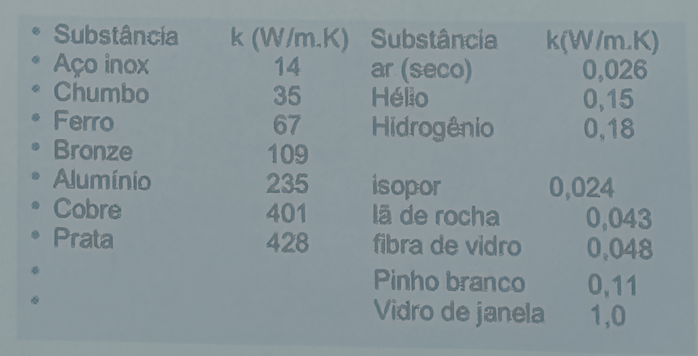

# Aula 2 - 13/08/2026

# Mecanismos de Transferência de Calor

## Condução

### Características

1. Ocorre entre 2 corpos que estejam em contato
	- Transferencia ocorre entre : maior > menor energia\
2. Deve existir uma diferença de temperatura entre estes dois corpos
3. Tem origem no comportamento da estrutura microscópica do material
4. A energia é transferia ao longo do material pela colisão entre átomos adjacentes

O processo é estacionário, $T_{H}$ e $T_{C}$ não mudam, e a taxa de transferência de calor é definida por :

$$ P_{cond} = \frac{Q}{\Delta t} = \frac{k \cdot A \cdot (T_i - T_f)}{L}$$

Um material bom condutor possui $\equiv k$ elevado, já um bom isolante, $k$ baixo. Em que $k$ é a condutividade térmica do material.

**Alguns valores de Condutivade Térmica**

## Radiação
### Características

1. Não precisa de contato, um meio, entre os corpos
2. A troca de energia é feita por meio de ondas eletromagnéticas
3. Este tipo de onda é chamada de radiação térmica
4. Todo corpo acima do zero absoluto emite radiação térmica
5. Não está relacionado, **absolutamente**, com a radiação nuclear

A taxa de emissão é dada por : 

$$ P_{\text{rad}} = \sigma \cdot \epsilon \cdot AT^{4}$$

onde : 

- $\sigma$ é a constante de Stefan-Boltzmann dada em $W/m^{2}K^{4}$
- $T$ é a temperatura do corpo
- $\epsilon$ é a emissividade da superfície variando de $0$ a $1$ (corpo negro)

A Taxa de absorção de radiação térmica é dada por :

$$ P_{\text{rad}} = \sigma \cdot \epsilon \cdot AT^{4}_{\text{amb}}$$

e a Taxa Líquida de absorção de radiação térmica é dada por :

$$ P_{\text{rad}} = \sigma \cdot \epsilon \cdot A(T^{4}_{\text{amb}} - T^{4})$$

## Convecção
### Características

1. Ocorre em meio fluido
2. Provocado por variações locais na densidade do fluido
3. Necessita de uma diferença de temperatura entre o fluido e uma superfície sólida
4. Fundamental para a descrição de fenômenos metereológicos
5. Modelelagem matemática é complexa

a Taxa é dada por : 

$$Q = h \cdot A \cdot (T_s - T_f)$$

## Calor e Trabalho

Em $1845$ joule propôs o Equivalente mecânico do calor, em que Trabalho ($J$)...