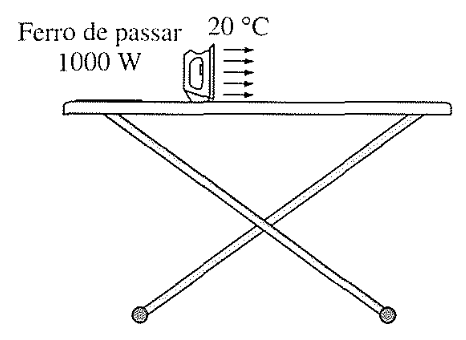
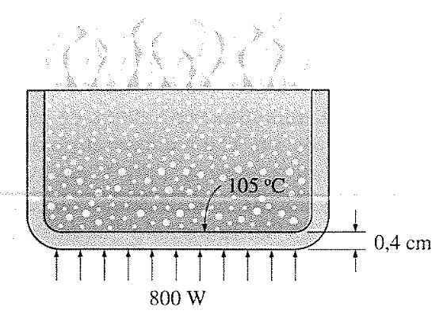
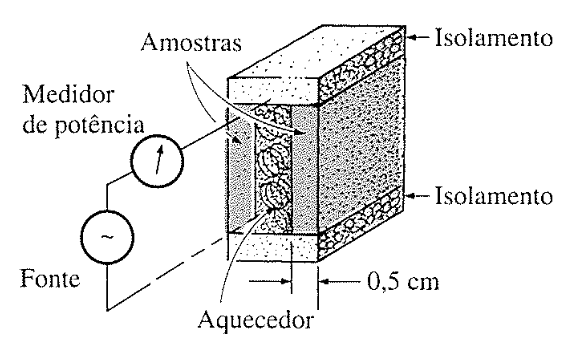
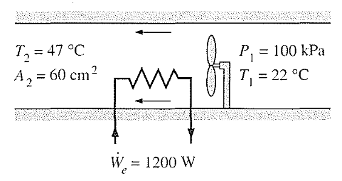

# Aula 7 - 08/09/2026

## Resolução de Exercícios

### 1-101

Um ferro de passar de $1000 \text{ W}$ é deixado sobre a tábua de passar com sua base exposta ao ar à temperatura de $20 \text{\degree C}$. O coeficiente de transferência de calor por convecção entre a superfície da base e o ar nas vizinhanças é de $35 \text{ W/} \text{m}^{2} \cdot{} \degree C$. Se a base tem uma emissividade de $0.6$ e uma área de $0.02$ $m^{2}$, determinar a temperatura da base do ferro.

**Solução**

Temos que a emissividade é de : $\varepsilon{} = 0.6$

$$\dot{Q_{total}} = \dot{Q_{conv}} + \dot{Q_{rad}} = 1000 \text{ W}$$

Onde,

$$ \dot{Q_{conv}} = hA_{s}\Delta{}T = (35 \text{ W}/m^{2} \cdot K)(0.02\ m^2)(T_{s} - 293\ K) = 0.7(T_{s} - 293\ K)$$

e

$$ \dot{Q_{rad}} = \varepsilon{}\sigma{}A_{s}(T_{s}^{4} - T_{o}^{4}) = (0.6)(0.02\ m^2)(5.67 \times 10^{-8}\ \text{W}/m^2 \cdot K^{4})[T_{s}^{4} - (293\ K)^{4}] $$

$$ \dot{Q_{rad}} = 0.06804 \times 10^{-8}[T_{s}^{4} - (293\ K)^{4}]$$

Substituindo...

$$1000\ \text{W} = (0.7)(T_{s} - 293\ K) + 0.06804 \times 10^{-8}[T_{s}^{4} - (293\ K)^{4}] $$

Por tentativa e erro, temos que : 

$$ \boxed{T_{s} = 947\ K = 649 \degree C} $$

### 1-58
Uma panela de alumínio cuja condutividade térmica é $237\ \text{W}/m^{2} \cdot \degree C$ tem um fundo chato com diâmetro de $15$ cm e espessura de $0,4$ cm. O calor é transferido permanentemente através do seu fundo a uma taxa de $800$ W para ferver água. Se a supetfície interna do fundo da panela está a $105 \degree C$, determinar a temperatura da supetfície externa do fundo da panela.

**Solução**

Sabendo que a constante de condutividade do Alumínio é de $237\ \text{W}/m^{2} \cdot \degree C$, temos que a área de transferência de calor se dá por : 

$$ A = \pi r^{2} = \pi(0.075\ \text{m})^{2} = 0.0177\ \text{m}^{2} $$

Em condições estacionárias, a taxa de transferência de calor se dá por :

$$ \dot{Q} = kA\dfrac{\Delta T}{L} = kA\dfrac{T_{2} - T_{1}}{L} $$

Substituindo os valores, temos que :

$$ 800\ \text{W} = (237\ \text{W}/m^{2} \cdot \degree C)(0.01177\ \text{m}^{2})\dfrac{T_{2} - 105\degree C}{0.004\ \text{m}} $$

$$ \boxed{T_{2} = 105.76\degree C} $$

### 1-61

Uma forma de medir a condutividade térmica de um material é fazer um sanduíche de um aquecedor elétrico entre duas amostras retangulares idênticas do material e isolar fortemente os quatro lados externos, como mostrado na figura. Termopares instalados nas superfícies interior e exterior das amostras registram as temperaturas.

Durante um experimento, duas amostras de $10\ \text{cm} \times 10\ \text{cm}$ de tamanho e $0.5$ cm de espessura foram utilizadas. Quando atingiu uma operação permanente, o aquecedor consumia $25\ \text{W}$ de potência elétrica e a temperatura de cada amostra observava uma queda de $82 \degree C$ na superfície interna para $74 \degree C$ na superfície externa. Determinar a condutividade térmica do material na temperatura média.

**Solução**

Para cada amostra, temos que : 

$$ \dot{Q} = 25 / 2 = 12.5\ \text{W} $$

$$ A = (0.1 \text{m})(0.1 \text{m}) = 0.01 \text{m}^{2} $$

$$ \Delta T = 82 - 74 = 8\degree C$$

Logo, a condutividade térmica $k$ do material se torna :

$$ \dot{Q} = kA\dfrac{\Delta T}{L} \rightarrow k = \dfrac{\dot{Q}{L}}{A\Delta T} = \dfrac{(12.5\ \text{W})(0.005\ \text{m})}{(0.01\ \text{m}^2)(8\degree C)}$$

$$\boxed{k = 0.781\ W/m \cdot \degree C}$$

### 1-32

Um secador de cabelo é basicamente um duto no qual algumas camadas de resistências elétricas são colocadas. Um pequeno ventilador puxa o ar e força-o a fluir ao longo dos resistores onde é aquecido. 

O ar entra num secador de cabelo de $1200\ \text{W}$ a $100\ \text{kPa}$ e $22\degree C$ e deixa-o a $47\degree C$. A área transversalna saída do secador de cabelo é de $60 \text{cm}^{2}$.

Desprezando a potência consumida pelo ventilador e as perdas de calor através das paredes do secador de cabelo, determinar (a) a vazão volumétrica de ar na entrada e (b) a velocidade do ar na saída.

**Solução**

