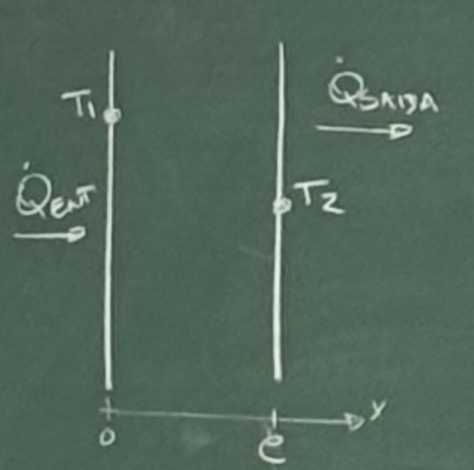

# Aula 8 - 10/09/2026

## Equação de Condução de Calor Permanente

- É permanente quando a temperatura não varia com o tempo ;
- Condução unidimensional ;
- A transferência de calor sob condições permanentes pode ser resolvida aplicando conceitos de resistência térmica de forma análoga a circuitos elétricos, não necessitando de equações diferenciais.

$$
\text{condução unidimensional} = 
\begin{cases} 
\text{plano} \\ 
\text{cilindro} \\ 
\text{esfera} 
\end{cases}
$$

- Raio Crítico
- Aletas

### Condução Permanente numa Parede Plana

$$ \dot{Q}_{ent} - \dot{Q}_{saída} = \dfrac{dE}{dt} = 0 $$

$$ \dot{Q}_{cond} = kA\dfrac{dT}{dx} = kA\dfrac{\Delta T}{e} = \dfrac{\Delta T}{\dfrac{e}{kA}} $$

$$ i = \dfrac{U}{R} $$

Logo, 

$$ \dot{Q} = \dfrac{\Delta T}{R} $$

$$ R_{cond_{plano}} = \dfrac{e}{kA} $$

Para a convecção

$$ \dot{Q}_{conv} = h.A.\Delta T $$

$$ \therefore R_{conv} = \dfrac{1}{hA} $$

### Condução Cilindro e Esfera

A transferência de calor através da parede do tubo ocorre normal à direção da superfície e não há transferência significativa nas outras direções. Como a parede do tubo é relativamente fina, teremos um gradiente de temperatura no sentido radial relativamente grande. Caso as temperaturas dos fluidos dentro e fora permaneçam constante, então a transferência de calor será permanente e o sistema poderá ser modelado unidimensionalmente. Assim $T(k)$ :

$$ \dot{Q} = kA \dfrac{dT}{dr} \rightarrow  \int_{r1}^{r2} \dfrac{\dot{Q}}{A}\ dr = - \int_{r1}^{r2} k\ dT $$

Como $ A = 2 \pi r L$

$$ \dot{Q} = 2 \pi k L \dfrac{T_{1}T_{2}}{\ln(\frac{r_2}{r_1})} $$

Como $ \dot{Q} = \dfrac{\Delta T}{R} $

$$ R_{cilíndro} = \dfrac{\ln(\frac{r_2}{r_1})}{2 \pi k L} $$
$$ R_{esfera} = \dfrac{r_2 - r_2}{4 \pi k r_1 r_2} $$